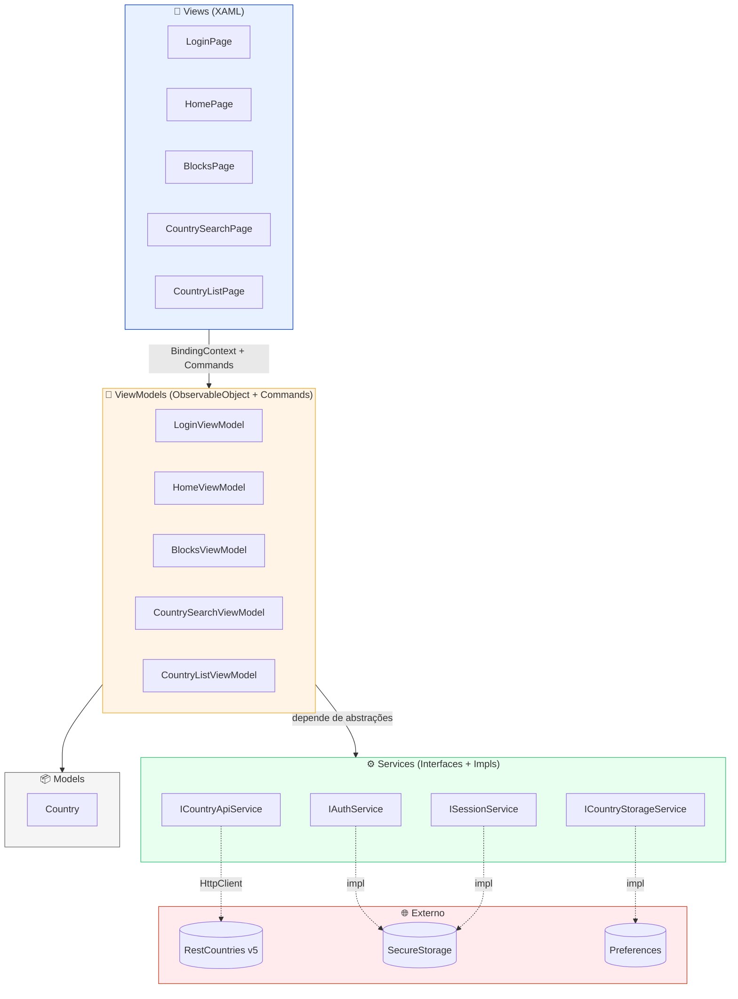
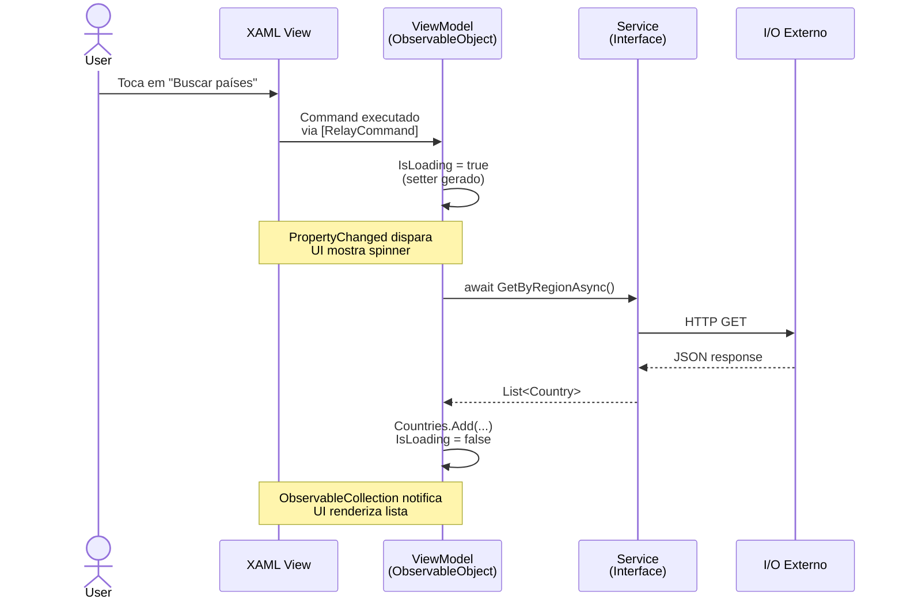
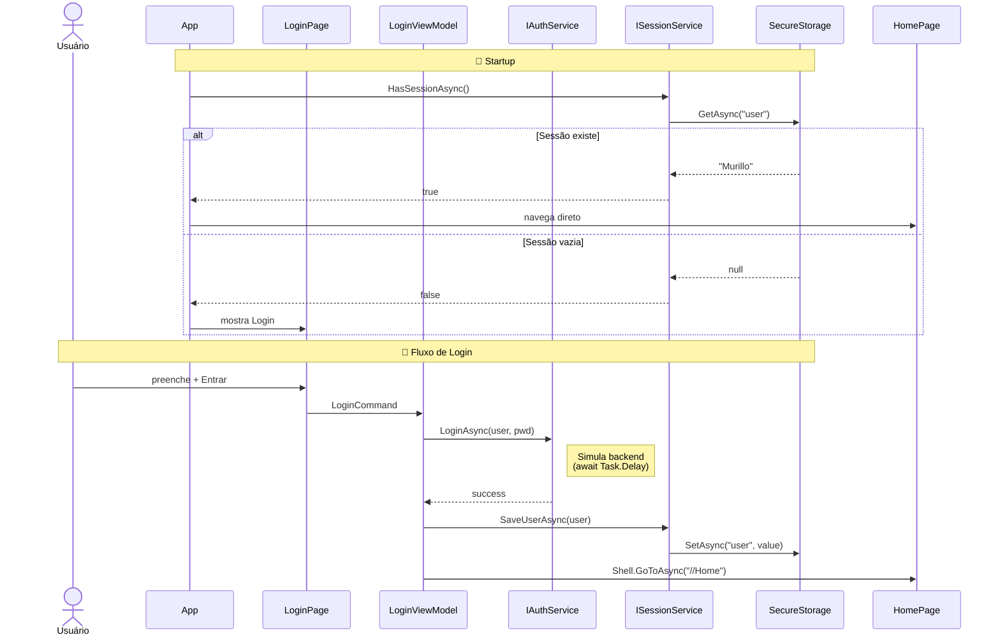
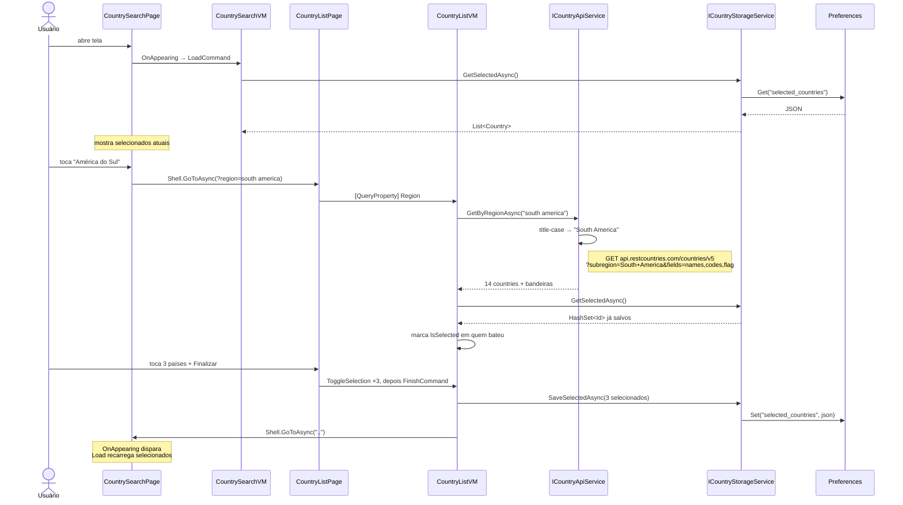
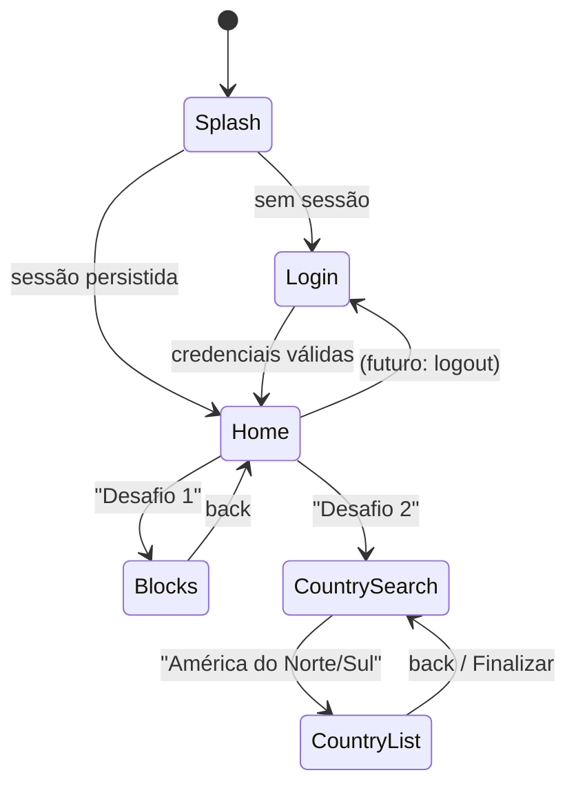

# Asaas Challenge — Pitch Técnico

> App .NET MAUI 10 com MVVM + Clean Architecture, integrado à API RestCountries,
> persistência local e navegação Shell.

**Autor:** Murillo Alves da Silva
**Data:** 13 de agosto de 2026
**Stack:** .NET MAUI 10 · C# 12 · CommunityToolkit.Mvvm 8.4 · CommunityToolkit.Maui 15.0

---

## 1. Elevator Pitch

Aplicativo mobile Android construído em **.NET MAUI 10** que entrega os 5 fluxos do desafio (Login → Home → Geração de Blocos + Busca de Países → Lista de Países) com **arquitetura em camadas**, **MVVM reativo via source generators**, **injeção de dependência nativa** e **persistência local** (sessão em `SecureStorage`, seleções em `Preferences`).

O foco não foi só *"fazer funcionar"*, mas construir uma base **testável, previsível e extensível**: cada tela tem sua ViewModel isolada, cada I/O externo (API, storage, sessão, auth) é abstraído por interface, e a navegação é declarativa via **Shell**. O resultado são ~1.500 linhas de código C# organizadas em 24 arquivos, sem overengineering — pronto pra receber testes unitários sem refatoração.

---

## 2. Stack Tecnológica

| Camada | Escolha | Motivo |
|---|---|---|
| **Framework** | .NET MAUI 10.0.60 | Requisito do desafio |
| **Linguagem** | C# 12 | Records, pattern matching, nullable ref types |
| **MVVM** | CommunityToolkit.Mvvm 8.4.2 | Source generators eliminam boilerplate (`[ObservableProperty]`, `[RelayCommand]`) |
| **UI Toolkit** | CommunityToolkit.Maui 15.0.0 | Toast, `InvertedBoolConverter`, sem dependências pesadas |
| **HTTP** | `IHttpClientFactory` + `System.Net.Http.Json` | Padrão .NET, DI first-class, sem NuGet extra |
| **API** | RestCountries **v5** com autenticação Bearer | v3.1 foi deprecada em 2026 — migração feita durante o desenvolvimento |
| **Sessão** | `SecureStorage` (Keychain iOS / Keystore Android) | Dado sensível não fica em plain-text |
| **Seleções** | `Preferences` + `System.Text.Json` | Nativo, zero setup, ideal pra chave-valor JSON |
| **Navegação** | Shell + `[QueryProperty]` | Rotas nomeadas, back stack automático |

---

## 3. Arquitetura em Camadas



**3 regras invioláveis:**

1. **View nunca fala com Service** — sempre passa pela ViewModel.
2. **ViewModel nunca instancia Service concreto** — recebe interface via DI (`MauiProgram.cs`).
3. **Service não conhece View nem ViewModel** — retorna DTOs/Models puros.

Isso permite (a) trocar `HttpClient` por mock em testes, (b) trocar `Preferences` por SQLite sem tocar em ViewModel, (c) rodar as VMs sem UI.

---

## 4. Fluxo MVVM Reativo (source generators)

Como um clique num botão vira uma UI atualizada:



**O que os source generators do CommunityToolkit fazem por baixo:**

- `[ObservableProperty] private bool isLoading;` → gera `public bool IsLoading { get; set; }` **com `INotifyPropertyChanged` já wired**.
- `[RelayCommand] private async Task LoadAsync()` → gera `public IAsyncRelayCommand LoadCommand { get; }` **thread-safe, com `CanExecute`**.

Sem source generators, isso são ~30 linhas por propriedade. Com, são 2.

---

## 5. Fluxo: Login + Sessão Persistente

Requisito 3.5 do PDF: "em caso de reabertura, redirecionar direto pra Home".



**Decisão de segurança:** `SecureStorage` usa **Android Keystore** por baixo — o dado é criptografado com chave que só o app tem acesso. Poderia ter usado `Preferences` (mais simples), mas usuário é PII.

---

## 6. Fluxo: Busca + Persistência de Países

Requisitos 6.2 e 7.x: seleção persistente entre reaberturas.



**Padrão notável:** `OnAppearing` na View chama `LoadCommand` da VM. Não uso `MessagingCenter` nem eventos — a página *pull-refreshes* toda vez que aparece. Simples, previsível, sem side effects.

---

## 7. Navegação (Shell)



**Todas as rotas são registradas em `AppShell.xaml.cs`** com `nameof(Page)`, o que dá refactor-safety no IDE.

---

## 8. Princípios Aplicados

### Clean Code
| Princípio | Como aplicado |
|---|---|
| **Nomes que dizem o que fazem** | `GetByRegionAsync`, `SaveSelectedAsync`, `ToggleSelection` — verbo + intenção, sem `Manager`/`Helper` |
| **Funções pequenas** | Nenhum método > 25 linhas. `LoadAsync` da `CountryListViewModel` é a maior (~20 linhas com try/catch/finally) |
| **Sem comentários redundantes** | Comentários só onde há decisão não-óbvia (ex: por que title-case da região) |
| **Guard clauses cedo** | `if (country is null) return;` em vez de aninhar |
| **Records para DTOs** | `CountryDto`, `NamesDto`, `FlagDto` — imutáveis, uma linha cada |

### Clean Architecture (adaptada ao escopo)
| Regra | Aplicação |
|---|---|
| **Dependency Rule** | Views → VMs → Services (nunca ao contrário) |
| **Interface Segregation** | `IAuthService`, `ISessionService`, `ICountryApiService`, `ICountryStorageService` — cada uma com 1-4 métodos |
| **Dependency Inversion** | VMs recebem interfaces via construtor; concretes só existem em `MauiProgram.cs` |
| **Boundaries claras** | DTOs da API (`CountryDto`) **não vazam** para VMs — mapeados pra `Country` no service |
| **Testabilidade** | Todas as VMs podem ser instanciadas em teste unitário passando mocks das interfaces |

---

## 9. Decisões Técnicas Notáveis

| # | Decisão | Alternativa descartada | Por quê |
|---|---|---|---|
| 1 | **CommunityToolkit.Mvvm** | `INotifyPropertyChanged` manual | 90% menos código de propriedade |
| 2 | **Preferences + JSON** para seleções | SQLite | Overkill pra lista de <30 itens |
| 3 | **SecureStorage** pra usuário | Preferences | PII merece Keystore |
| 4 | **Migração para v5** durante o desenvolvimento | Ficar em v3.1 | v3.1 retornou erro em prod (deprecada em 2026) |
| 5 | **Endpoint `?subregion=` + title-case** | `region=americas` + filtro client-side | Menos payload, mais preciso |
| 6 | **`?fields=names,codes,flag`** | Trazer objeto completo | Payload ~10x menor |
| 7 | **`OrderBy` no service** | Ordenar na VM | Service já entrega pronto — VM não precisa saber |
| 8 | **`StoredCountry` record separado do `Country`** | Serializar `Country` direto | `Country` herda `ObservableObject` (metadados desnecessários no JSON) |
| 9 | **Toast para limite de blocos** | Alert bloqueante | Menos fricção, não interrompe input |
| 10 | **Shell + rotas nomeadas** | NavigationPage manual | Refactor-safe, deep-linking gratuito |

---

## 10. Cobertura vs. Requisitos do PDF

| Item | Requisito | Status |
|---|---|---|
| 1.1 | .NET MAUI 10, C# 12+, restcountries.com | ✅ |
| 1.1 | iOS ou Android (≥1 rodando) | ✅ Android |
| 3.1 | Login: campos + botão Entrar | ✅ |
| 3.3 | Simulação de requisição | ✅ (`AuthService` com delay) |
| 3.4 | Navegação para Home | ✅ |
| 3.5 | Sessão persistente | ✅ `SecureStorage` |
| 4.1 | Nome do usuário no topo | ✅ |
| 4.2 | Botões Desafio 1 / Desafio 2 | ✅ |
| 4.3 | Versão do app no rodapé | ✅ `AppInfo.VersionString` |
| 5.1 | Grid dinâmico de blocos | ✅ reativo ao input |
| 6.1 | Botões América do Norte/Sul | ✅ |
| 6.2 | Lista de selecionados persistida | ✅ `Preferences` + JSON |
| 7.1 | Request restcountries com região | ✅ subregion query |
| 7.2 | Nome **e bandeira** do país | ✅ `FlagUrl` remoto |
| 7.3 | Botão Finalizar volta com seleção | ✅ |
| 8.1 | ZIP sem bin/obj | ✅ entregue |

---

## 11. O Que Faria Com Mais Tempo

1. **Testes unitários** das ViewModels com xUnit + Moq (base já pronta pra isso).
2. **API key em `Constants.cs`** ao invés de hardcoded em `MauiProgram.cs`.
3. **Retry policy** no `HttpClient` com Polly (exponential backoff em 5xx).
4. **Toast "Países salvos"** ao clicar em Finalizar.
5. **Empty state ilustrado** em CountrySearchPage quando nada foi selecionado.
6. **Logout** na Home (botão) limpando `SecureStorage`.
7. **Localização** (pt-BR / en-US) via `.resx`.
8. **iOS build** (bloqueado pelo Xcode 26.6 no ambiente atual).

---

## 12. Estrutura de Arquivos

```
AsaasChallenge/
├── Models/
│   └── Country.cs               # Id, Name, FlagUrl, IsSelected
├── Services/
│   ├── IAuthService.cs          # LoginAsync
│   ├── AuthService.cs
│   ├── ISessionService.cs       # Save/Get/Clear + HasSessionAsync
│   ├── SessionService.cs        # SecureStorage
│   ├── ICountryApiService.cs    # GetByRegionAsync
│   ├── CountryApiService.cs     # HttpClient v5 + DTOs internos
│   ├── ICountryStorageService.cs # Get/Save/Remove/Clear
│   └── CountryStorageService.cs # Preferences + JSON
├── ViewModels/
│   ├── LoginViewModel.cs
│   ├── HomeViewModel.cs
│   ├── BlocksViewModel.cs
│   ├── CountrySearchViewModel.cs
│   └── CountryListViewModel.cs
├── Views/
│   ├── LoginPage.xaml + .cs
│   ├── HomePage.xaml + .cs
│   ├── BlocksPage.xaml + .cs
│   ├── CountrySearchPage.xaml + .cs
│   └── CountryListPage.xaml + .cs
├── Resources/
│   ├── Fonts/ (OpenSans)
│   ├── Images/ (back_arrow, x_circle, etc)
│   └── Styles/ (Colors, Styles — tokens do Figma)
├── App.xaml + .cs               # Startup + rota inicial
├── AppShell.xaml + .cs          # Registro de rotas
└── MauiProgram.cs               # DI container + HttpClient
```

---

<p align="center"><em>Obrigado pela oportunidade. Pronto para conversar sobre qualquer decisão. 🚀</em></p>
